  

  

  

---

## 01 // SYSTEM STATUS 🚀

  

🎓 Computer Science Graduate, University of West London – RAK Branch

Passionate about **AI**, **Machine Learning**, and **Software Development**. I enjoy building projects, exploring emerging technologies, and turning ideas into practical solutions through hands-on learning and hackathons.

I enjoy taking an idea from:

problem → model → API → interface → deployable product

My current focus is on AI engineering, machine learning, backend development, automation, and full-stack applications.
 
---

## 02 // TECH STACK 

  

  

  

  <strong>Also experienced with:</strong> 
  Pandas • NumPy • Scikit-Learn • Google Colab • Oracle SQL Developer • Canva • Trello • ClickUp • Wix • XML

---

## 03 // ACTIVE MISSIONS

> Not just projects. Experiments in turning ideas into systems.

### 🧠 MISSION 01 — Explainable AI

**[Explainable AI For Breast Cancer Diagnosis](https://github.com/Thaspeeha/Explainable-AI-For-Breast-Cancer-Diagnosis)**

A machine-learning system exploring how predictive models can become more interpretable through explainability techniques.

MODEL       → XGBoost
EXPLAINER   → SHAP
BACKEND     → FastAPI
FRONTEND    → Next.js
DATABASE    → MongoDB Atlas
INFRASTRUCTURE  → Docker

Best model

` Accuracy    ███████████████████░  97.37% ` · `AUC        ████████████████████  0.994 `

-→ SHAP explanations
-→ Global feature importance
→ Clinician-focused interface
→ Multiple explanation modes

### 🛰️ MISSION 02 — Anthos Terra

**[NASA Space Apps Challenge 2025](https://github.com/Thaspeeha/Anthos-Terra-NASA-2025)**

A platform for monitoring, analysing and forecasting plant blooming events using Earth-observation data and open datasets.

`🏆 LOCAL WINNER` · `🌍 GLOBAL NOMINEE` · `🛰️ NASA SPACE APPS 2025`

### 🌡️ MISSION 03 — UAE HeatLens

**[Innovation Hackathon 2025](https://github.com/Thaspeeha/Urban-Heat)**

An urban analytics concept focused on understanding and mitigating Urban Heat Island effects in dense environments such as Downtown Dubai.

DATA → ANALYSIS → VISUALISATION → INSIGHT

Built around the intersection of:

AI × Data × Sustainability × Urban Innovation

### 🌱 MISSION 04 — TerraQuest

**[National Student Competition on Technology and Sustainability - RAK EISC 2026](https://github.com/Thaspeeha/Terra-Quest)**

A gamified sustainability platform designed to turn environmentally friendly actions into measurable impact.

ECO ACTION
    ↓
GAME MECHANICS
    ↓
USER ENGAGEMENT
    ↓
MEASURABLE IMPACT

`🌱 EISC 2026` · `🏆 WINNER` · `🎮 GAMIFICATION` · `🌍 SUSTAINABILITY`

---

## 04 // QUEST LOG

[✓] Learn Computer Science
[✓] Build full-stack applications
[✓] Explore Machine Learning
[✓] Build an Explainable AI system
[✓] Compete in hackathons
[✓] NASA Space Apps
[✓] Build AI + sustainability projects..
[✓] Graduate with BSc (Hons) Computer Science

[→] Become a stronger AI Engineer
[→] Build production-ready AI systems
[→] Explore Agentic AI
[→] Contribute to Open Source
[→] Ship more things

---

## 05 // ACHIEVEMENT UNLOCKED

| Achievement |	Status |
|--|--|
🛰️ NASA Space Apps | 🏆 Local Winner
🌍 NASA Space Apps	| 🌐 Global Nominee
🌱 TerraQuest |	🏆 EISC Winner
🌡️ UAE HeatLens	|🚀 Innovation Project
🧠 Explainable AI |	🚀 Completed
💻 Full-Stack Development	|⚡ Building
🤖 AI Engineering	|🔥 Current Focu

---

## 🏆 Experience & Activities

### 🚀 Hackathons & Competitions

- **[NASA Space Apps Challenge 2025](https://github.com/Thaspeeha/Anthos-Terra-NASA-2025)**
- **[National Student Competition on Technology and Sustainability - RAK EISC 2026](https://github.com/Thaspeeha/Terra-Quest)**
- **[Create Apps Championship 2025-26](https://github.com/Thaspeeha/Seha-Quest)**
- **[AI Genesis 2025](https://github.com/Thaspeeha/Nova-Health)**
- **[META x Starbucks Student Hackathon 2025](https://github.com/Thaspeeha/StarBrew-Lens)**
- **[Innovation Hackathon 2025](https://github.com/Thaspeeha/Urban-Heat)**
- **[Payit App Features Pitch](https://github.com/Thaspeeha/Payit-App-Features-Pitch)**

### 🏆 Experience

- Medulla Products and Consulting LLC - Web Development Intern
- **[Afzar Consultants LLC - Afzar Hydraulics](https://github.com/touseefspace/Afzar-Hydraulics)**

### 💻 University Projects

- **[Explainable AI For Breast Cancer Diagnosis](https://github.com/Thaspeeha/Explainable-AI-For-Breast-Cancer-Diagnosis)**
- **[Machine Learning](https://github.com/Thaspeeha/Machine-Learning)**
- **[Mobile Web App Development](https://github.com/Thaspeeha/Mobile-Web-App-Development)**
- **[Artificial Intelligence](https://github.com/Thaspeeha/Artificial-Intelligence)**
- **[E-Commerce Web Development](https://github.com/Thaspeeha/E-Commerce_Web_Development)**
- **[UI-UX App Development](https://github.com/Thaspeeha/UI-UX_App_Development)**
- **[Programming Project](https://github.com/Thaspeeha/Programming-Project)**

### 🔨 Personal Projects

- **[MiniCart](https://github.com/Thaspeeha/MiniCart)**
- **[Python Project](https://github.com/Thaspeeha/Python-Project)**
- **[codealpha tasks](https://github.com/Thaspeeha/codealpha_tasks)**
- **[Personal Portfolio Website](https://github.com/Thaspeeha/Personal-Portfolio-Website)** - *Under Development*

---

## 📰 Featured & Recognized

- **[Samsung Innovation Campus 2025](https://www.linkedin.com/pulse/ai-office-collaboration-samsung-gulf-electronics-qjncf/?trackingId=gPlXcmdYjwdB2ev9GQpWCw%3D%3D)** — Featured for participating in the Samsung Innovation Program, celebrated the graduation of 130 students from across the Emirates.
- **[Innovation Hackathon 2025-OCT](https://canva.link/m57zg37iofy2qmn)** — Featured on the UWL Newsletter 'WIRE' as part of the hackathon event, highlighted our experience as the finalists.
- **[Innovation Challenge Program and Growth Summit by First Abu Dhabi Bank 2023-DEC](https://canva.link/8k5woz9ei8153wr)** — Featured on the UWL Newsletter 'WIRE' as part of the hackathon event, highlighted our experience as the finalists.
  
---

## 📈 Contribution Activity

  

---

## 🎯 Goals for 2026

- Build impactful AI and Machine Learning projects
- Gain industry experience through internships
- Strengthen software engineering fundamentals
- Contribute to open-source projects
- Continue learning emerging technologies
- Grow as an AI and Software Engineer

---

## 💭 Fun Facts

- 🤖 Curious about almost everything AI.
- ☕ Debugging teaches patience better than meditation.
- 🌙 Some of my best ideas appear late at night.
- 🚀 Always excited to learn new technologies and build cool things.

---

## 🤝 Connect With Me

  

  

---

  <i>"Learning never exhausts the mind."</i> 
  — Leonardo da Vinci

