  

  

  

---

  

Backend AI Engineer (Intern) at FlyRank AI, building APIs with Python and FastAPI. I work across the full stack — front-end interfaces, back-end services, and ML models — and enjoy turning ideas into practical solutions through hands-on projects and hackathons.

I enjoy taking an idea from:

problem → model → API → interface → deployable product

My current focus is on AI engineering, machine learning, backend development, automation, and full-stack applications.
 
---

## 02 // TECH ARSENAL 

  

  

  <strong>Also experienced with:</strong> 
  Pandas • NumPy • Scikit-Learn • Google Colab • SQL • Canva • Trello • ClickUp • Turbopack • Cursor

  

---

## 03 // FIELD OPERATIONS

Professional experience gained while working on real-world software and AI-related challenges.

### 🤖 AI / ML INTERN

**Samsung Innovation Campus — AI/ML, Dubai**

`Oct 2025 — Nov 2025` · `Remote`

Participated in a structured AI/ML programme with weekly live sessions covering machine learning fundamentals, model development, and applied project work.

---

### ⚙️ SOFTWARE DEVELOPER INTERN

**[Afzar Consultants LLC - Afzar Hydraulics, Sharjah](https://github.com/touseefspace/Afzar-Hydraulics)**

`Jun 2025 — Jul 2025` · `Remote`

Worked on a Python-based simulation engine for engineering computations, translating mathematical formulas into backend algorithms and supporting testing, validation, and documentation.

---

### 💻 WEB DEVELOPMENT INTERN

**Medulla Productions & Consulting LLC, Sharjah**

`Aug 2025 — Dec 2025` · `Remote`

Contributed to SaaS frontend development by building responsive UI components and data-driven interfaces, translating requirements into usable features, and collaborating on testing and code review.

---

## 04 // HACKATHON LAB

> **Where ideas get stress-tested.**

A collection of challenges where I explored AI, sustainability, education, climate, health, automation, and product innovation.

<h3>
  🌱 MISSION 01 - TerraQuest
  
</h3>

**[National Student Competition on Technology and Sustainability - RAK EISC 2026](https://github.com/Thaspeeha/Terra-Quest)**

A gamified sustainability platform designed to turn environmentally friendly actions into measurable impact.

ECO ACTION → USER ENGAGEMENT → MEASURABLE IMPACT

`🌱 EISC 2026` · `🏆 WINNER` · `🎮 GAMIFICATION` · `🌍 SUSTAINABILITY`

<h3>
  🏁 MISSION 02 - SehaQuest
  
</h3>

**[Create Apps Championship 2025-26](https://github.com/Thaspeeha/Seha-Quest)**

<h3>
  🤖 MISSION 03 - Nova Health
  
</h3>

**[AI Genesis 2025](https://github.com/Thaspeeha/Nova-Health)**

<h3>
  ☕ MISSION 04 - StarBrew Lens
  
</h3>

**[META x Starbucks Student Hackathon 2025](https://github.com/Thaspeeha/StarBrew-Lens)**

<h3>
  🌡️ MISSION 05 - UAE HeatLens
  
</h3>

**[Innovation Hackathon 2025](https://github.com/Thaspeeha/Urban-Heat)**

An urban analytics concept focused on understanding and mitigating Urban Heat Island effects in dense environments such as Downtown Dubai.

DATA → ANALYSIS → VISUALISATION → INSIGHT

Built around the intersection of:

AI × Data × Sustainability × Urban Innovation

<h3>
  🛰️ MISSION 06 - NASA Space Apps
  
</h3>

**[NASA Space Apps Challenge 2025](https://github.com/Thaspeeha/Anthos-Terra-NASA-2025)**

A platform for monitoring, analysing and forecasting plant blooming events using Earth-observation data and open datasets.

`🏆 LOCAL WINNER` · `🌍 GLOBAL NOMINEE` · `🏆 HONORABLE MENTION` · `🛰️ NASA SPACE APPS 2025`

<h3>
  💡 MISSION 07 - Payit App Features Pitch
  
</h3>

**[Payit App Features Pitch](https://github.com/Thaspeeha/Payit-App-Features-Pitch)**

### 🧭 THEMES

`AI` · `Sustainability` · `Climate` · `Education` · `Health` · `Automation` · `Product Innovation`

---

## 05 // 💻 ACADEMIC MISSIONS

> Not just projects. Experiments in turning ideas into systems.

<h3>
  🧠 MISSION 08 - Explainable AI
  
</h3>

**[Explainable AI For Breast Cancer Diagnosis](https://github.com/Thaspeeha/Explainable-AI-For-Breast-Cancer-Diagnosis)**

A machine-learning system exploring how predictive models can become more interpretable through explainability techniques.

- MODEL       → XGBoost
- EXPLAINER   → SHAP
- BACKEND     → FastAPI
- FRONTEND    → Next.js 
- DATABASE    → MongoDB Atlas
- INFRASTRUCTURE  → Docker

Best model

` Accuracy    ███████████████████░  97.37% ` · `AUC        ████████████████████  0.994 `

→ SHAP explanations
→ Global feature importance
→ Clinician-focused interface
→ Multiple explanation modes

`💻 University Project`

- **[Databases & Analytics](https://github.com/Thaspeeha/DBA-Colab-Notebooks)**
- **[Machine Learning](https://github.com/Thaspeeha/Machine-Learning)**
- **[Mobile Web App Development](https://github.com/Thaspeeha/Mobile-Web-App-Development)**
- **[Artificial Intelligence](https://github.com/Thaspeeha/Artificial-Intelligence)**
- **[E-Commerce Web Development](https://github.com/Thaspeeha/E-Commerce_Web_Development)**
- **[UI-UX App Development](https://github.com/Thaspeeha/UI-UX_App_Development)**
- **[Programming Project](https://github.com/Thaspeeha/Programming-Project)**

---

## 06 // 🔨 SIDE MISSIONS

- **[Student-Performance-AI-Analysis](https://github.com/Thaspeeha/Student-Performance-AI-Analysis)**
- **[Study-Burnout-Detector](https://github.com/Thaspeeha/Study-Burnout-Detector)**
- **[MiniCart](https://github.com/Thaspeeha/MiniCart)**
- **[Python Project](https://github.com/Thaspeeha/Python-Project)**
- **[codealpha tasks](https://github.com/Thaspeeha/codealpha_tasks)**
- **[Personal Portfolio Website](https://github.com/Thaspeeha/Personal-Portfolio-Website)** - *Under Development*

---

---

## 08 //  MISSION ACCOLADES

> Recognition collected along the way.

| YEAR | MISSION | OUTCOME |
|------|---------|---------|
| 2026 | RAK EISC | 🏆 **WINNER** |
| 2025/26 | Create Apps Championship | 🚀 **High-Potential Team** |
| 2025 | NASA Space Apps | 🛰️ **Local Winner — Ajman** |
| 2025 | NASA Space Apps | 🌎 **Global Nominee** |
| 2025 | NASA Space Apps | 🏅 **Honorable Mention** |
| 2025 | Samsung Innovation Campus | 🤖 **AI Course Participant** |
| 2025 | Innovation Hackathon | 🏁 **Hackathon Finalist** | 
| 2023 | Innovation Challenge Program and Growth Summit by FAB | 🏁 **Hackathon Finalist** | 

---

## 09 // TRAINING DECK

#### 🏆 <a href="https://www.linkedin.com/in/thaspeeha-vahithu-a139b627a/details/certifications/">CERTIFICATE VAULT</a>

2 phases ( AWS AI Practitioner Challenge Phase (Mar - June), 'Completed' -> Future AWS AI Programmer Nanodegree Phase, 'Aug 2026 - Present' )

---

## 10 // 📰 Featured & Recognized

- **[Samsung Innovation Campus 2025](https://www.linkedin.com/pulse/ai-office-collaboration-samsung-gulf-electronics-qjncf/?trackingId=gPlXcmdYjwdB2ev9GQpWCw%3D%3D)**, **[Highlights](https://www.linkedin.com/posts/activity-7430534029713694720--pKb?utm_source=share&utm_medium=member_desktop&rcm=ACoAAEQitS8B9Zd9iJzEX1DtzEumSWLNC8Z3hxw)** — Featured for participating in the Samsung Innovation Program, celebrated the graduation of 130 students from across the Emirates.
- **[Innovation Hackathon 2025-OCT](https://canva.link/m57zg37iofy2qmn)**, **[Highlights](https://www.instagram.com/uwl_uae/p/DQEXMUnkizi/?img_index=4)** — Featured on the UWL Newsletter 'WIRE' as part of the hackathon event and highlighted our experience as the finalists.
- **[Innovation Challenge Program and Growth Summit by First Abu Dhabi Bank 2023-DEC](https://canva.link/8k5woz9ei8153wr)**, **[Highlights](https://www.instagram.com/uwl_uae/reel/C1EvjsmtNq2/)** — Featured on the UWL Newsletter 'WIRE' as part of the hackathon event and highlighted our experience as the finalists.

---

## 11 // GITHUB TELEMETRY

  

---

## 12 // BEYOND THE CODE

☕ Debugging teaches patience better than meditation.

🌙 Some of my best ideas appear late at night.

🧠 I learn fastest when I build.

🚀 Hackathons are where ideas get stress-tested.

🔭 Curiosity is probably my most-used dependency.

---

## 13 // TRANSMISSION

#### ALWAYS LEARNING. ALWAYS BUILDING. ALWAYS SHIPPING.

 

> **The mission is not to build more software.**  
> **It's to build software that matters.**

 

`THASPEEHA VAHITHU`

**AI × SOFTWARE × CREATIVITY**

   

---
